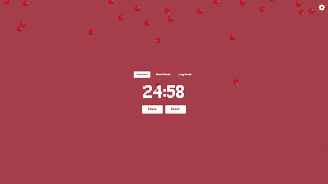
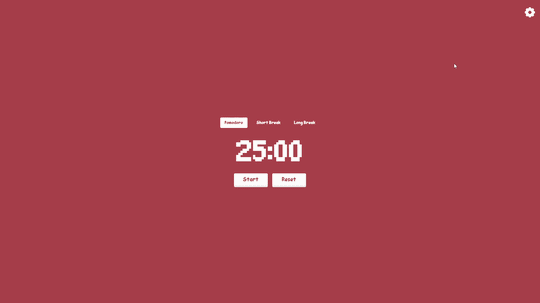

# Pomodoro Timer




[Description](#description) • [Features](#features) • [Installation](#installation)

## Description

A pixel-style Pomodoro Timer built with React and TypeScript, featuring customizable timer durations, manual mode switching and sound controls.

## Features

### Timer Controls

Start, pause, and reset the timer.


### Manual Mode Switching

Switch between Pomodoro, short break, and long break at any time.


### Custom Settings

You can adjust timer durations and sound volume at any time, even during an active session



## Installation

Clone the repository

```bash
git clone https://github.com/Woefulking/Pomodoro-Timer.git
cd Pomodoro-Timer
```

Install dependencies

```bash
npm install
```

Run the project

```bash
npm run dev
```
